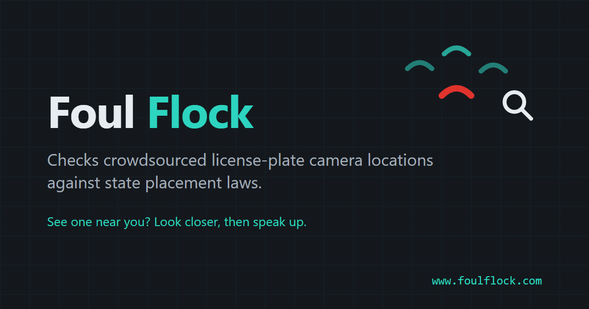

# Foul Flock · ALPR Siting Compliance Map



Live at [www.foulflock.com](https://www.foulflock.com). Made by
[lowlydba](https://github.com/lowlydba).

A small, fully static map that cross-references crowdsourced ALPR camera
locations (OpenStreetMap, [DeFlock](https://deflock.me) tagging convention)
against a hand-curated table of **state camera-siting statutes**, and flags
cameras sitting within a screened distance of a protected place: schools,
places of worship, healthcare facilities, courts, food banks.

A few states have decided license-plate cameras don't belong near certain
places. Laws like that only matter if someone checks, and checking by hand
is slow enough that it rarely happens. This map automates the tedious
part.

To be clear about what it is: a **screening tool for advocacy and
compliance research**. Not a router, not a camera-avoidance app, and
**not legal advice**. Every flag carries a statute citation and the law's
own placement language, and the UI walks the user toward a verify-first
inquiry or records-request letter. Rule provenance (`confidence`,
`last_verified`) stays in the rules file for maintainers; the UI
deliberately doesn't dress heuristic candidates up as verified findings.

## What the colors mean

The map deliberately distinguishes:

1. 🔴 **Flagged** - camera sits within the screened distance of a protected
   place. Comes with the statute citation; needs human verification.
2. 🔵 **Checked, nothing found** - a siting law exists in this state, and no
   mapped protected place turned up within the screened distance.
3. ⚪ **Reviewed, no siting law** - grey on the map, with a last-checked
   date on hover. States that haven't been reviewed get no overlay at all,
   because "we looked and there's nothing" and "we haven't looked" are
   different claims.

## Heuristic distances

When a statute uses vague language ("immediately surrounding") instead of
a number, the build applies a configurable **"close by" default of 100 m**.
That number is ours, not the law's, and the UI labels it as such everywhere
it appears (`buffer_specified: false` in the rules file).

Two legend sliders adjust the heuristics live, no rebuild needed (the build
pre-computes candidates out to `--scan-max`, 400 m):

- **"Close by"** (50-400 m, default 100) for statutes with no distance
  language at all.
- **"On premises"** (10-150 m, default 50) for on-property language like
  VA's "on or within the boundaries of" (`heuristic_buffer_meters` in the
  rules file).

Statutory numeric distances are fixed and unaffected by either slider.
Change the defaults with `--default-buffer` or `default_heuristic_buffer_m`
in `rules/alpr_state_rules.yaml`.

Whenever a heuristic distance is used, the UI and the drafted report letter
also quote the statute's actual placement language ("on or immediately
surrounding", "on or within the boundaries of", etc.) from the
`statutory_language` field, so the on-property vs. nearby distinction is
never hidden behind an invented number.

## View cones

Where OSM records a `camera:direction` bearing, the map draws an
illustrative view cone (60 degrees wide, 60 m deep, zoom in to see them).
OSM has no field-of-view width/range tags for ALPRs, so cones show mapped
bearing only - they are not real detection zones.

## Layout

```
rules/alpr_state_rules.yaml   Hand-curated legal core. Never scraped/automated.
build/build.py                Fetch (cached) -> match -> emit web/data/*.geojson
build/vendor/                 Pinned Overture places taxonomy (CC-BY-4.0)
web/                          Static MapLibre app (no backend, no runtime APIs)
docs/research/                Archived state-law survey outputs
cache/                        Overpass + Overture response cache (safe to delete)
AGENTS.md                     Maintenance runbook (state re-reviews, overrides)
```

## Build & run

```powershell
pip install pyyaml overturemaps
python build\build.py                        # fetches (cached), then matches
python -m http.server 8080 -d web            # then open http://localhost:8080
```

Useful flags: `--offline` (cache only), `--refresh [scope]` (ignore cache
and refetch; scope is `all` or a comma-separated subset of
`cameras,places,divisions`), `--states WA` (subset).

A scheduled workflow (`.github/workflows/data-refresh.yml`) refreshes
cameras weekly and Overture places/divisions monthly (matching Overture's
monthly release cadence), then opens a PR with the regenerated
`web/data/*`, so the published data stays current without manual runs.

### Tests

The Python build pipeline is unit-tested with pytest, and WCAG 2.1 A/AA is
asserted with axe-core + Playwright in both light and dark color schemes
(see AGENTS.md for the theming rules):

```powershell
pip install -r tests\python\requirements.txt
python -m pytest tests\python

npm ci
npx playwright install chromium
npm run test:a11y
```

CI runs both suites on every push/PR (`.github/workflows/ci.yml`, axe
against fixture data in `tests/fixtures/data`) and rolls them into a
single required check. Workflow security is linted by zizmor at its
pedantic persona (`.github/workflows/zizmor.yml`), and dependabot watches
actions, npm, and pip weekly.

## Data sources

| Source | Provides | License |
|---|---|---|
| OpenStreetMap via Overpass | ALPR camera nodes (`surveillance:type=ALPR`, DeFlock convention) | ODbL |
| Overture Maps places theme | Protected places (schools, worship, healthcare, courts, food banks) | CDLA-Permissive-2.0 |
| Overture Maps divisions theme | State boundary polygons + GERS division IDs | Contains OSM data: ODbL |
| Overture places taxonomy (vendored, `build/vendor/`) | Category codes mapped to the five protected categories | CC-BY-4.0 |
| `rules/alpr_state_rules.yaml` | Hand-curated statutes, buffers, citations | Project |

Places and divisions are streamed per state from the Overture S3 release
via the official [`overturemaps`](https://github.com/OvertureMaps/overturemaps-py)
package (anonymous reads, no credentials) and filtered locally against the
vendored taxonomy; category-to-protected-place mapping lives in
`category_overture_mapping` in the rules YAML. Cameras stay on
OSM/Overpass because Overture has no ALPR layer. `state_division_id` on
each rule records the state's Overture GERS division ID.

## License

Code is [MIT](LICENSE). The data is not: OSM-derived files (cameras, and
state boundaries via Overture divisions) remain under
[ODbL 1.0](https://opendatacommons.org/licenses/odbl/) © OpenStreetMap
contributors, and Overture places remain under
[CDLA-Permissive-2.0](https://cdla.dev/permissive-2-0/) © Overture Maps
Foundation. The build stamps a `DATA_LICENSE.txt` into `web/data/`
alongside the artifacts, and the vendored taxonomy in `build/vendor/` is
CC-BY-4.0. Keep those notices intact when redistributing.

## Maintaining the rules file

- Human-authored only. **Do not scrape legal text.**
- Every entry needs `source_url`, `confidence`
  (`verified`/`inferred`/`needs_review`), and `last_verified`.
- Re-review quarterly - ALPR siting law is an actively moving target.
- If a statute gives no numeric distance, set `buffer_meters: null` and
  `buffer_specified: false`; never invent a number and present it as law.

## Honesty notes

These are load-bearing, not boilerplate:

- Siting-specific ALPR laws are rare; most state ALPR statutes govern
  retention/access, not placement.
- Camera positions are crowdsourced and can be wrong, stale, or mis-tagged.
- A flag is a *candidate for human verification*, never a violation
  determination. Verify camera, place, and current statute text before
  contacting any agency.
- Camera data © OpenStreetMap contributors (ODbL). Places and boundaries
  © Overture Maps Foundation (places CDLA-Permissive-2.0; divisions
  contain OSM data, ODbL).
